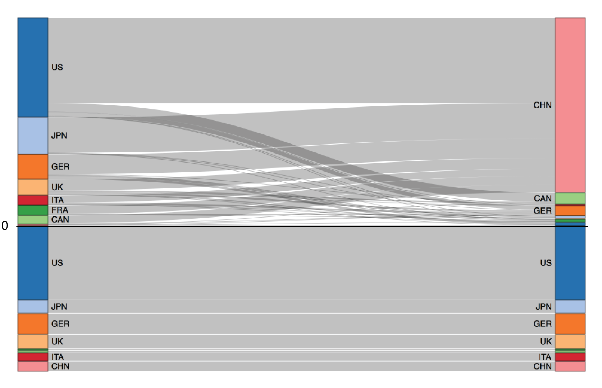

```{r setup, include=FALSE}
knitr::opts_chunk$set(echo = TRUE)
```

## Sankey

### History

- 2016-06-03: initial Sankey
- 2016-06-04: updated Sankey
    - created combined positive + negative interactive sankey for true relative heights
    - reduced nodePadding to 1
    - turned off crowded country labels

### Setup

```{r positive sankey}
suppressPackageStartupMessages({
  library(dplyr)
  library(tidyr)
  library(readxl)
  library(networkD3)
})

# read excel
d = read_excel(
  'data/Table_sourcing_terremissions_by_c_2016-05-18.xlsx', col_names=F) 
# View(d)
```

### Positive Interactive

```{r}
# get matrix of data for sourcing to emitting
m = d[2:9, 1:9]
names(m) = c('sourcing', as.character(d[1, 2:9]))

# nodes_p: unique sourcing and emitting countries
nodes_p = data_frame(
  country = c(m$sourcing, names(m)[2:ncol(m)]),
  type    = c(
    rep('sourcing', 8),
    rep('emitting', 8))) %>%
  mutate(
    name = sprintf('%s-%0.1s', country, type),
    id   = as.integer(row_number() - 1))

# links_p: get positive values, except to self country
links_p = m %>%
  gather(emitting, mtons_co2, -sourcing) %>%
  mutate(
    mtons_co2 = as.numeric(mtons_co2)) %>%
  filter(
    sourcing != emitting,
    mtons_co2 > 0) %>%
  left_join(
    nodes_p %>% 
      filter(type == 'sourcing') %>%
      select(sourcing=country, id_sourcing=id), 
    by='sourcing') %>%
  left_join(
    nodes_p %>% 
      filter(type == 'emitting') %>%
      select(emitting=country, id_emitting=id), 
    by='emitting') %>%
  arrange(id_sourcing, id_emitting)

# positive sankey ----
sankeyNetwork(
  Nodes = as.data.frame(nodes_p), 
  NodeID = 'country',
  Links = as.data.frame(links_p), 
  Source = 'id_sourcing', Target = 'id_emitting', Value = 'mtons_co2',
  units = "MMt CO2", fontSize = 12, nodeWidth = 30, fontFamily = 'sans-serif')
```


### Negative Interactive

```{r negative sankey}
# negative sankey ----
n = d[24:31,2:3] %>%
  select(country=X1, value=X2) %>%
  mutate(
    value = as.numeric(value),
    sign  = 'negative',
    role  = 'sourcing')

# nodes_n: unique sourcing and emitting countries
nodes_n = data_frame(
  country = c(n$country, n$country),
  type    = c(
    rep('sourcing', nrow(n)),
    rep('emitting', nrow(n)))) %>%
  mutate(
    name = sprintf('%s-%0.1s', country, type),
    id   = as.integer(row_number() - 1))

# links_n: get positive values, except to self country
links_n = n %>%
  mutate(
    mtons_co2 = abs(value),
    sourcing = country,
    emitting = country) %>%
  left_join(
    nodes_n %>% 
      filter(type == 'sourcing') %>%
      select(sourcing=country, id_sourcing=id), 
    by='sourcing') %>%
  left_join(
    nodes_n %>% 
      filter(type == 'emitting') %>%
      select(emitting=country, id_emitting=id), 
    by='emitting') %>%
  arrange(id_sourcing, id_emitting)

# plot negative sankey
sankeyNetwork(
  Nodes = as.data.frame(nodes_n), 
  NodeID = 'country',
  Links = as.data.frame(links_n), 
  Source = 'id_sourcing', Target = 'id_emitting', Value = 'mtons_co2',
  units = "MMt CO2", fontSize = 12, nodeWidth = 30, fontFamily = 'sans-serif')
```

### Combined Interactive

```{r}
# all nodes: positive + negative with new ids
id_n0 = max(nodes_p$id) + 1
nodes_a = nodes_p %>%
  mutate(
    sign = 'positive',
    name = sprintf('%0.1s-%s', sign, name)) %>%
  bind_rows(
    nodes_n %>%
      mutate(
        id   = id + id_n0,
        sign = 'negative',
        name = sprintf('%0.1s-%s', sign, name)))

links_a = links_p %>%
  bind_rows(
    links_n %>%
      mutate(
        id_sourcing = id_sourcing + id_n0,
        id_emitting = id_emitting + id_n0))

# labels
nodes_a$label = nodes_a$country
# turn off labels for crowded countries
lbls_off = c(
  'p-CHN-s','n-CAN-s',                                       # positive, sourcing
  'p-ITA-e','p-JPN-e','p-JPN-e','p-FRA-e','p-UK-e','p-US-e', # positive, emitting
  'n-FRA-s','n-CAN-s',                                       # negative, sourcing
  'n-FRA-e','n-CAN-e')                                       # negative, emitting
nodes_a$label[nodes_a$name %in% lbls_off] = ''

# plot all sankey
sankeyNetwork(
  Nodes = as.data.frame(nodes_a), 
  NodeID = 'label', NodeGroup = 'country',
  Links = as.data.frame(links_a), 
  Source = 'id_sourcing', Target = 'id_emitting', Value = 'mtons_co2',
  units = "MMt CO2", 
  fontSize = 14, fontFamily = 'sans-serif',
  nodePadding = 1, nodeWidth = 50)
```

### Combined Static

Plot in RStudio, export as PNG, assemble in Adobe Illustrator:

- add horizontal line
- add 0




```{r skip, echo=F, eval=F}

# OLD...

# bind other positive/emitting parts of excel
bind_rows(
d[16:23,2:3] %>%
select(country=X1, value=X2) %>%
mutate(
  value = as.numeric(value),
  sign  = 'positive',
  role  = 'sourcing'),
d[16:23,6:7] %>%
  select(country=X5, value=X6) %>%
  mutate(
    value = as.numeric(value),
    sign  = 'positive',
    role  = 'emitting'),
d[24:31,6:7] %>%
  select(country=X5, value=X6) %>%
  mutate(
    value = as.numeric(value),
    sign  = 'negative',
    role  = 'emitting'))

# export SVG
library(htmltools)
button = tags$button("Download",
  class="bookmarklet ver2", 
   onclick="(function () { 
      var e = document.createElement('script');
      e.setAttribute('src', 'https://nytimes.github.io/svg-crowbar/svg-crowbar-2.js');
      e.setAttribute('class', 'svg-crowbar'); 
      document.body.appendChild(e); })();
   "
)
browsable(tags$html(sN, button))
```
